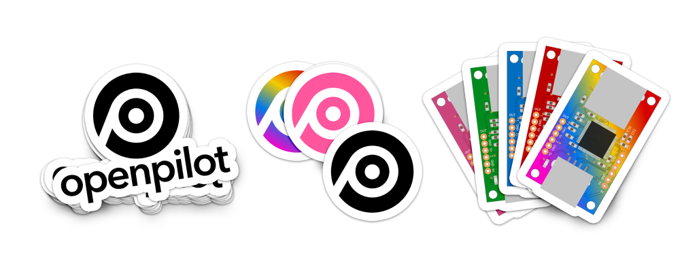

# Introduction

Welcome to The Openpilot Documentation Project.

The open source initiative to document [commaai/openpilot](https://github.com/commaai/openpilot), hardware it supports, and the vehicles it supports... all with the goal of aiming to be written for people of any skill level.

Our documents and guides will try not to assume prior knowledge of any specific term or topic (within reason).

# Why

The current goals of the openpilot project have a lot to do with progress and prototyping to move the technology forward and very few people are interested in moving the on-boarding experience forward.  That's nobody's fault really, it's just the facts.

So the goal is to bring a fresh take to the on-boarding experience to the table.

What better way to do that than with GitHub and some Markdown.

## Help create documentation

Your contributions to the documentation are always welcome and will continue to make this a necessary resource for newcomers and veterans alike.

[About Contributing](documentation/contributing.md)

## Support the efforts

All of this is paid for and maintained for free.

### Buy stickers, show support

If you're interested, we are offering beautiful stickers for sale to help support the project, domain expenses, and hosting expenses.

We will also vow to continue to donate our time to writing great articles and documents for you and the community.

[Buy some stickers now!](https://redbubble.com/jfrux)