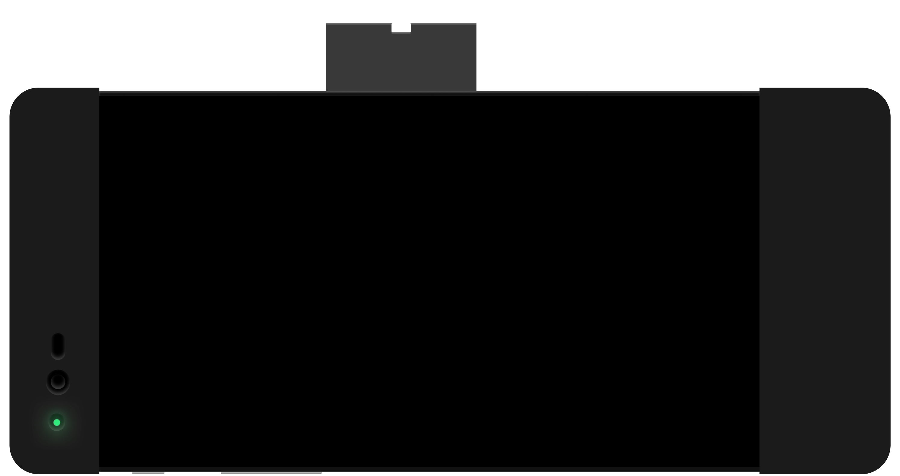

# About EON

The EON is sold as a Dashcam by Comma.ai, Inc.  However, it is commonly not purchased for that purpose, rather; is used by motivated people to install third-party open source software on it known as [openpilot]().

## What is it made of?

You'll notice that it looks like a cellphone with a funny case on it.

That's because that is precisely what it is in essence.  This is an [OmniPlus 3T](https://www.oneplus.com/3t) mobile smart phone loaded with a custom version of Android maintained by the team at [Comma.ai, Inc](https://comma.ai/).

Mounted to the back of it, and held on but 3D Printed ABS panels and pieces is a custom PCB board with a fan and large heat sync used to regulate the device from overheating because of how the CPU is clocked to do things it wasn't really ever designed to do.  Which although sounds bad, is actually an amazing thing for a smartphone and it's job is very important so that's why it exists.

